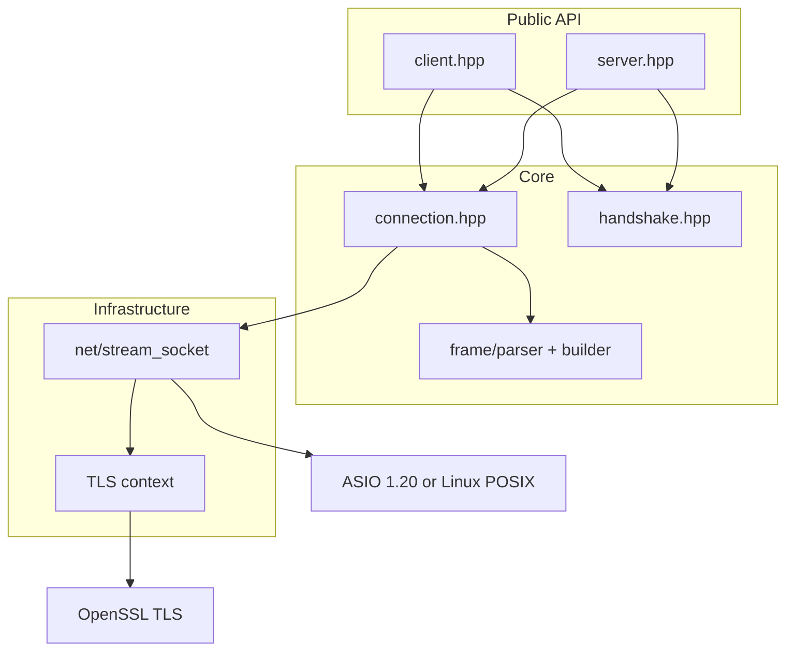

# wscpp — Developer Guide

## Project status

wscpp is **experimental** and was **implemented entirely with AI assistance** (LLM agents). Treat design decisions and diffs as proposals until reviewed. See [AGENTS.md](../AGENTS.md) for agent workflow guidelines used in this repository.

## Architecture



Layer responsibilities:

| Layer | Role |
|-------|------|
| `client` / `server` | URL parsing, accept loop, TLS + HTTP upgrade orchestration |
| `connection` | Frame I/O, background reader, callbacks |
| `handshake` | RFC 6455 Sec-WebSocket-Key / Accept |
| `frame` | RFC 6455 framing parse/build |
| `net/` | TCP + TLS stream (`asio_socket` or `linux_socket` via `WSCPP_USE_ASIO`) |
| TLS | `asio::ssl::context` (ASIO) or `net::openssl_context` (linux transport) |
| `detail/log` | Optional spdlog backend for internal error diagnostics (`WSCPP_ENABLE_LOGGING`) |

## Code conventions

- **`C++11`**, public I/O returns `std::error_code` (no exceptions from library connect/send paths)
- `pimpl` idiom for `client`, `server`, `connection`, socket types
- Match existing naming: `snake_case` methods, `opcode` enum in `frame` namespace
- Protocol changes require RFC cross-check (see below)
- Commit messages in English; one logical change per commit when following the implementation plan

See [CONTRIBUTING.md](../CONTRIBUTING.md) for contribution workflow.

## Building

```bash
cmake -B build -DCMAKE_BUILD_TYPE=Debug
cmake --build build
```

CMake options (selected):

| Option | Default | Description |
|--------|---------|-------------|
| `WSCPP_USE_ASIO` | ON | ASIO transport; OFF = Linux POSIX sockets |
| `WSCPP_ENABLE_DEFLATE` | ON | RFC 7692 permessage-deflate (zlib) |
| `WSCPP_ENABLE_LOGGING` | ON | spdlog error diagnostics to stderr; OFF = no-op stubs |
| `WSCPP_BUILD_BENCHMARKS` | OFF | Micro-benchmarks under `benchmarks/` |

When logging is enabled, spdlog v1.14.1 is fetched via FetchContent (header-only in `src/log.cpp` only, not exported as a public link dependency). The spdlog include path is marked `SYSTEM` so CI clang-tidy does not analyze third-party headers. Public API: `wscpp/log.hpp` (`set_log_level`). Instrumentation lives in `connection`, `server`, and `net/*` error paths.

CI format/lint scripts scan only first-party trees; FetchContent deps under `build/_deps/` are excluded.

Targets:

| Target | Description |
|--------|-------------|
| `wscpp` | Static library |
| `wscpp_test_unit` | Unit tests |
| `wscpp_test_integration` | Client/server integration |
| `wscpp_test_regression` | RFC 6455 frozen vectors |
| `wscpp_test_stress` | Stress tests (requires `-DWSCPP_ENABLE_STRESS_TESTS=ON`) |
| `bench_frame_parse`, `bench_masking`, `bench_roundtrip` | Micro-benchmarks (`-DWSCPP_BUILD_BENCHMARKS=ON`) |
| `bench_roundtrip_net`, `bench_echo_server` | LAN echo client/server pair |
| `compare_net_clients`, `compare_net_servers` | Full LAN compare suite (see `benchmarks/README.md`) |
| `bench_websocketpp_roundtrip`, … | Comparative localhost latency vs other libraries |
| `docs` | Doxygen HTML |
| `wscpp_example_*` | Example binaries |

Micro-benchmarks are for development regression. **Publish comparative results in `ANALYSIS.md` only after RFC-mandated behaviour is complete** (see `benchmarks/README.md` and `ANALYSIS.md` → Methodology).

## Running tests

```bash
cd build
ctest --output-on-failure                    # all enabled tests
ctest -R FrameTest --output-on-failure       # filter by name
ctest -R wscpp_test_unit                     # unit suite
```

### CI pipeline (GitHub Actions)

Jobs run in order: **format** → **lint** (clang-tidy) → **test** (ASIO + linux transport, GCC + Clang) → **release-build** → **release** (tags `v*` only).

Local checks:

```bash
./scripts/ci/check-format.sh
cmake -B build -DCMAKE_EXPORT_COMPILE_COMMANDS=ON && cmake --build build
./scripts/ci/clang-tidy.sh build
```

Workflow artifacts (Doxygen HTML, release tarball) are kept for **5 days**.
Tag releases are published with `gh release create` (library tarball + API docs archive).

Stress tests (local only, not CI by default):

```bash
cmake -B build -DWSCPP_ENABLE_STRESS_TESTS=ON
cmake --build build
ctest -R StressIntegration
```

## RFC / doc-rag workflow

Before changing protocol behaviour, consult RFC sources via the project knowledge base (`doc-rag` MCP):

- **RFC 6455** — framing (§5), handshake (§4), close (§7), ping/pong (§5.5)
- **RFC 2818** — HTTP over TLS, server identity for `wss://`
- **RFC 5246** — TLS basics

Add regression vectors in `tests/regression/` for any framing or handshake change.

## Release process

1. Ensure `ctest` passes and Doxygen builds without undocumented public API warnings
2. Update `CHANGELOG.md` (Keep a Changelog format)
3. Run `./scripts/bump_version.sh major|minor|patch` (or explicit `X.Y.Z`)
4. Reconfigure CMake, rebuild, re-run tests
5. Tag: `git tag vX.Y.Z && git push origin vX.Y.Z`

Version is authoritative in the `VERSION` file; CMake generates `wscpp_version.h`.

## API Reference (Doxygen)

Mandatory for v1.0. Configuration: root `Doxyfile`.

```bash
cmake -B build -DWSCPP_BUILD_DOCS=ON
cmake --build build --target docs
```

Output: `build/docs/html/index.html`

CI publishes the `docs/html/` artifact when Doxygen is available.

## HANDOFF log

Session progress is appended to [HANDOFF.md](HANDOFF.md) after each plan step (commit + handoff entry).
