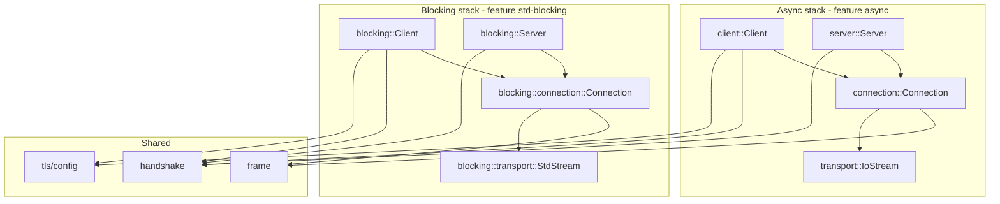

# ws-rs — Rust Developer Guide

**ws-rs** is the Rust companion to [wscpp](../README.md): same layering (frame → handshake → connection → client|server), independent SemVer (`rust/VERSION`, currently **0.4.0**).

## Workspace layout

| Crate / path | Role |
|--------------|------|
| `rust/ws-rs` | Library (`ws_rs` on crates.io path) |
| `rust/ws-rs-benches` | C++-parity benchmark binaries |
| `rust/examples/*` | echo and TLS echo CLIs |
| `rust/benchmarks/` | `run_benchmarks.sh`, `run_remote_network_compare.sh` |

## Architecture



**API style:** pull/async (`read_message`, `recv_text`) — not C++ callbacks. Protocol behaviour matches wscpp; surface API is idiomatic Rust.

## Features (`ws-rs` Cargo features)

| Feature | Default | Description |
|---------|---------|-------------|
| `async` | yes | Tokio client/server |
| `tls` | yes | Async `wss://` (rustls + tokio-rustls) |
| `blocking-tls` | yes | Sync `wss://` for `ws_rs::blocking` |
| `deflate` | yes | RFC 7692 permessage-deflate |
| `std-blocking` | yes | `std::net` stack |
| `stress` | no | Heavy integration tests |

Minimal build (no tokio):

```bash
cargo build -p ws-rs --no-default-features --features "std-blocking,deflate,blocking-tls"
```

## Build and test

```bash
cd rust
cargo test --workspace -- --test-threads=1   # integration tests use ports
cargo build --release -p echo_server -p echo_client
```

Stress tests (optional, mirrors C++ `WSCPP_ENABLE_STRESS_TESTS`):

```bash
cargo test -p ws-rs --features stress --test stress
```

## Formatting, linting, docs

Local gate (same as CI):

```bash
./scripts/ci/check-rust.sh
```

| Step | Command | Policy |
|------|---------|--------|
| Format | `cargo fmt --all --check` | `rust/rustfmt.toml` |
| Clippy | `RUSTFLAGS="-D warnings" cargo clippy --workspace --all-targets` | all compiler/clippy warnings as errors |
| Tests | same `RUSTFLAGS` | |
| API docs | `RUSTDOCFLAGS="-D rustdoc::broken_intra_doc_links" cargo doc -p ws-rs --no-deps` | broken intra-doc links fail CI; `#![warn(missing_docs)]` + `RUSTFLAGS="-D warnings"` require docs on all public items |

Open docs locally:

```bash
cd rust && cargo doc -p ws-rs --no-deps --open
```

## Code conventions

- **Edition 2021**, `Result<T, ws_rs::Error>` for I/O (no panics on protocol paths)
- Match wscpp RFC behaviour; regression vectors in `ws-rs/tests/rfc6455_compliance.rs`
- Network integration tests: `#[serial]` via `serial_test` (safe parallel `cargo test`)
- Commit messages in English; one logical change per commit

## Benchmarks

See [rust/README.md](../rust/README.md) and [ANALYSIS_RUST.md](../ANALYSIS_RUST.md).

```bash
bash rust/benchmarks/run_benchmarks.sh
bash rust/benchmarks/run_remote_network_compare.sh
```

## Release (ws-rs)

1. Update notes in `ANALYSIS_RUST.md` changelog table
2. `./scripts/bump_rust_version.sh patch|minor|major`
3. `./scripts/ci/check-rust.sh`
4. Tag: `git tag ws-rs-vX.Y.Z`

Runtime: `ws_rs::version::VERSION`, `major()`, `minor()`, `patch()`.

## CI

GitHub Actions job **Rust (ws-rs)** on `master`:

- `cargo fmt --all --check`
- `RUSTFLAGS="-D warnings" cargo clippy --workspace --all-targets`
- `cargo test --workspace -- --test-threads=1`
- Release build of echo examples
